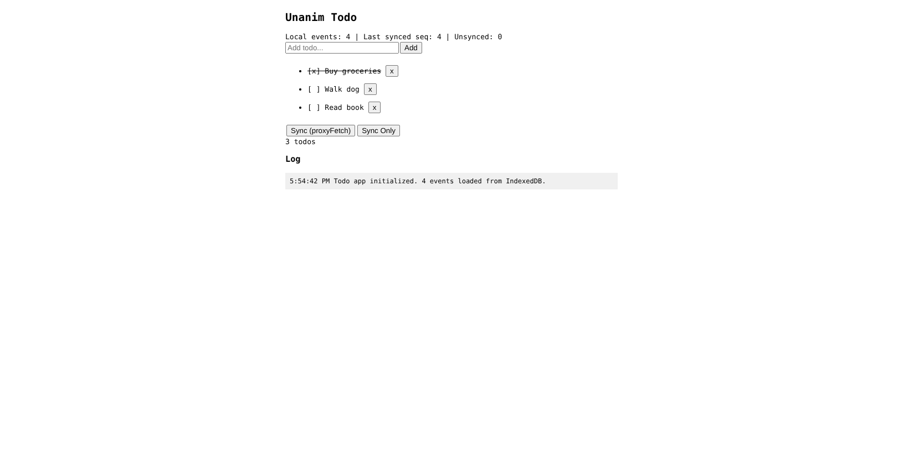

# Todo Reference App Validation Log

**Date:** 2026-02-10
**Issue:** #28 — Todo reference app (validation/deployment)
**Deployment URL:** https://unanim-todo.mike-solomon.workers.dev

## Deployment

- Worker deployed via `npx wrangler deploy` from `validation/todo_deploy/`
- Secret `TEST_API_KEY` set via `wrangler secret put`
- Smoke test: `GET /do/status` returned `{"event_count": 0, "latest_sequence": 0}` — PASS

## Browser Test Results

All tests performed via Chrome DevTools MCP on `http://localhost:8091/index.html`.

| # | Test | Result |
|---|------|--------|
| 1 | Add 3 todos (Buy groceries, Walk dog, Read book) | PASS — 3 todos rendered, status shows 3 local events |
| 2 | Sync (proxyFetch) | PASS — "Sync OK. 1143ms", synced seq advanced to 3, unsynced = 0 |
| 3 | Toggle todo (Buy groceries) | PASS — shows `[x]`, strikethrough, 4 local events, 1 unsynced |
| 4 | Sync Only | PASS — "Sync-only OK. 61ms", synced seq advanced to 4, unsynced = 0 |
| 5 | Page refresh (persistence) | PASS — "4 events loaded from IndexedDB", all 3 todos preserved with correct toggle state |
| 6 | Status bar accuracy | PASS — correctly shows event counts, synced sequence, unsynced delta |

## Artifact Size Budgets (VISION.md Section 8.2)

| Artifact | Size (gzipped) | Budget | Status |
|----------|---------------|--------|--------|
| Worker JS | 3.1 KiB | 5 KiB | OK |
| IndexedDB wrapper | 0.7 KiB | 3 KiB | OK |
| Sync layer | 1.4 KiB | 2 KiB | OK |
| HTML shell (with framework) | 1.9 KiB | 2 KiB | OK |

All artifacts within budget.

## ProxyFetch Latency

- proxyFetch round-trip (with 3-event delta + httpbin.org API call): **1143ms**
- Sync-only (1-event delta, no API call): **61ms**

## Screenshot

